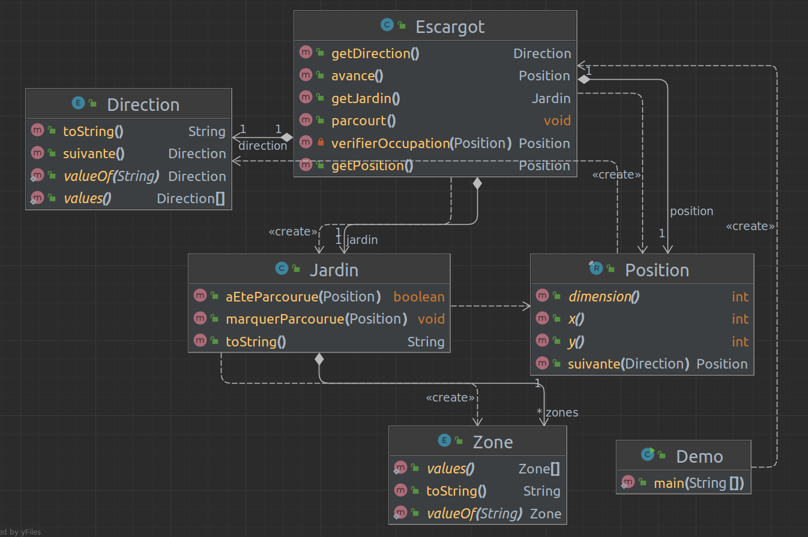

# Kata de l'escargot

Le kata de l'escargot est un exercice de programmation assez classique qui consiste à faire se déplacer un escargot en colimaçon, dans le sens des aiguilles d'une montre, dans un jardin carré.

Par exemple, pour un jardin de 3 unités de côté, on parcourt le jardin en 9 étapes si on compte la position initiale.

Au départ l'escargot se trouve en haut à gauche du jardin, puis parcourt celui-ci en allant vers la droite, puis vers le bas, ensuite vers la gauche puis en haut, et ainsi de suite jusqu'à ce que toutes les zones du jardin aient été parcourues.

## Tests

On a 26 tests utilisant uniquement JUnit 5 afin de limiter les dépendances du projet.

Sont utilisés notamment :

- Un nommage `quand_on_a_cela_en_entree_alors_on_obtient_ceci_en_sortie`
- L'annotation `@DisplayName` de JUnit 5
- Les softs assertions de JUnit 5 via `assertAll`
- Des classes internes

Et certains tests sont paramétriques.

Pour lancer les tests :

```console
./gradlew test
```

## Demo

Pour voir l'escargot se déplacer dans le jardin :

```console
./gradlew run
```

```console
X . .
. . .
. . .

X X .
. . .
. . .

X X X
. . .
. . .

X X X
. . X
. . .

X X X
. . X
. . X

X X X
. . X
. X X

X X X
. . X
X X X

X X X
X . X
X X X

X X X
X X X
X X X
```

## Implémentation

Le code est écrit en Français !

On trouve 3 classes Java dont un `record`:

- [Escargot.java](src/main/java/org/grumpyf0x48/escargot/Escargot.java): la bestiole !
- [Jardin.java](src/main/java/org/grumpyf0x48/escargot/Jardin.java): là ou se promène l'escargot
- [Position.java](src/main/java/org/grumpyf0x48/escargot/Position.java): là où il se trouve

Ainsi que 2 `enum`:

- [Direction.java](src/main/java/org/grumpyf0x48/escargot/Direction.java): dans quelle direction il va
- [Zone.java](src/main/java/org/grumpyf0x48/escargot/Zone.java): une zone du jardin

Et une classe de lancement:

- [Demo.java](src/main/java/org/grumpyf0x48/escargot/Demo.java): la classe lancée par `./gradlew run`

## Diagramme de classes

